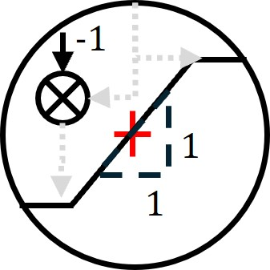
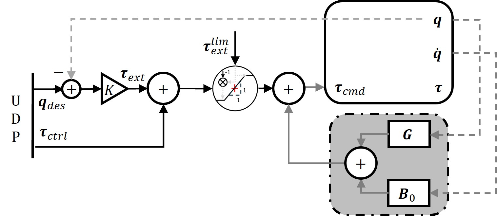
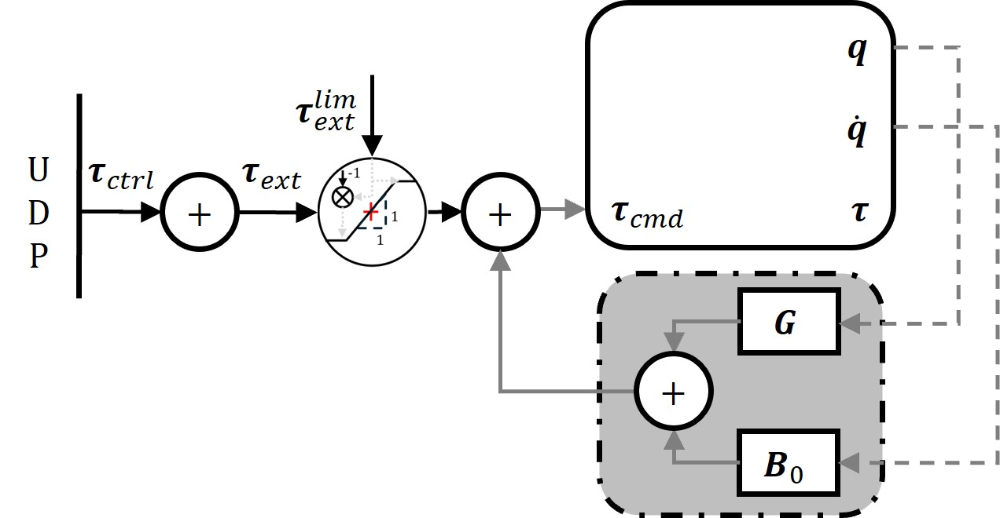
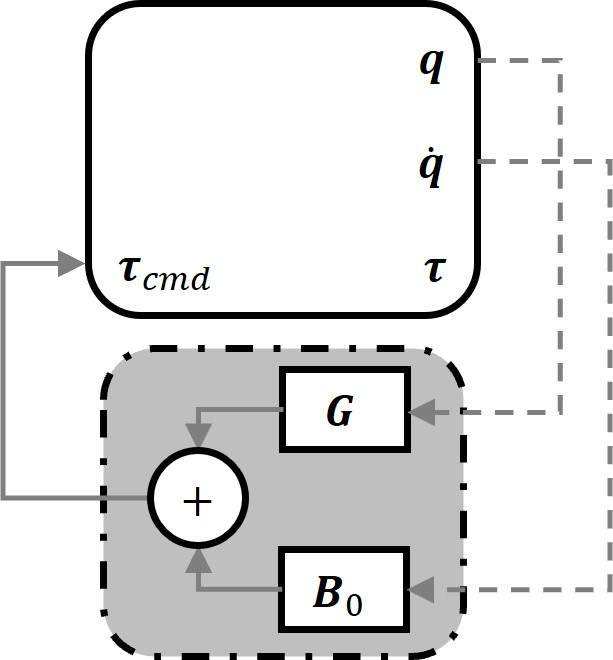
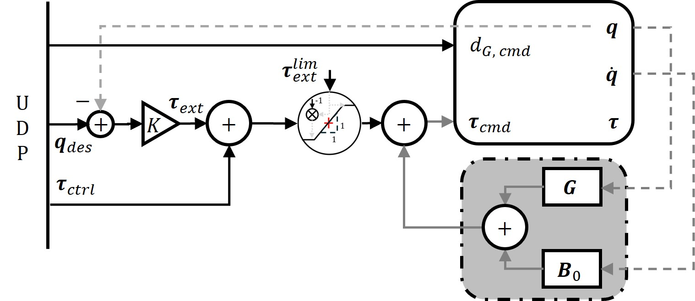

# myKINOVA
Towards building contact rich manipulation frameworks with the Kinova gen3 ultralightweight robots

## Pre-Requisites
1. Install [CMake](https://github.com/Kitware/CMake/releases/download/v3.29.0-rc1/cmake-3.29.0-rc1-windows-x86_64.msi)
2. Get [Visual Studio 2019](https://github.com/harshaturlapati/myKINOVA/blob/main/vs_community__98951435.1629706453.exe)
3. Install Boost [using these instructions](https://gist.github.com/zrsmithson/0b72e0cb58d0cb946fc48b5c88511da8)
4. Install [Qt OpenSource](https://master.qt.io/new_archive/qt/5.9/5.9.2/qt-opensource-windows-x86-5.9.2.exe)
5. Install [Robotics Library](https://github.com/roboticslibrary/rl/releases/download/0.7.0/rl-0.7.0-msvc-14.1-x64.msi)

### Build Robotics Library
1. Download the [source code and additional examples](https://www.roboticslibrary.org/download) and extract the archives.
2. In a cmd **opened as administrator**:
```console
cmake -E tar x rl-0.7.0.zip
cmake -E tar x rl-examples-0.7.0.zip
cd rl-0.7.0
mkdir build
cd build
cmake -G "Visual Studio 16 2019" -D CMAKE_INSTALL_PREFIX="C:\Program Files\Robotics Library\0.7.0\MSVC\14.1\x64" ..
cmake --build . --config Release --target INSTALL
```
## Unpack myKINOVA
1. Clone this repository via Visual Studio
2. Use the CMakeLists to set things up : Project -> Configure kortexApiCppExamples
3. Build -> Build all

fin

# Control strategies for single arm

### Saturation function

In all the strategies listed below, the external torque used to drive the robot is limited by a saturation function. The purpose is to ensure no high torque is transmitted to the low-level controller of the robot. Note that this may have consequences in your application and will need to be adjusted to allow for high-torque or dynamical control behaviors.

<!-- New line here... -->
---
The UDP need not operate at a high frequency, the low-level torque controller of the robot will still function. These control strategies allow to vary the following variables

| Variable            |    Name |
| -----------         | ------- |
| **$q$**$_{des}$     | Desired joint configuration |
| **$\tau$**$_{cmd}$  | Joint torque command |

## Mode 0 - Impedance control


<!-- New line here... -->
---

## Mode 1 - Impedance and torque control

<!-- New line here... -->
---

## Mode 2 - Torque control

<!-- New line here... -->
---

## Mode 3 - Gravity compensation

<!-- New line here... -->
---

## Mode 5 - Impedance, torque and gripper control

<!-- New line here... -->
---
